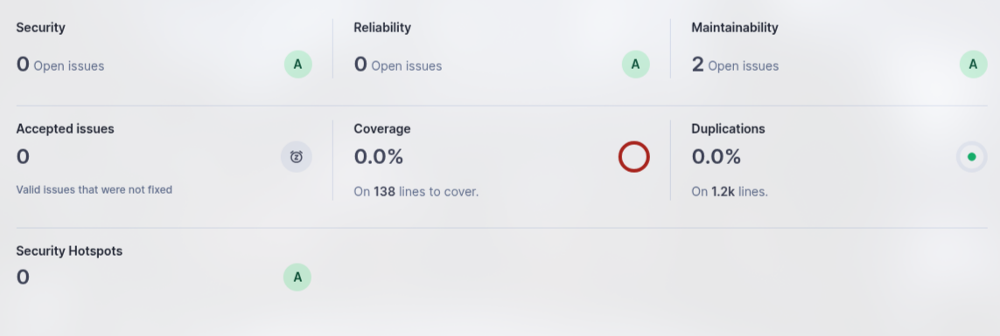
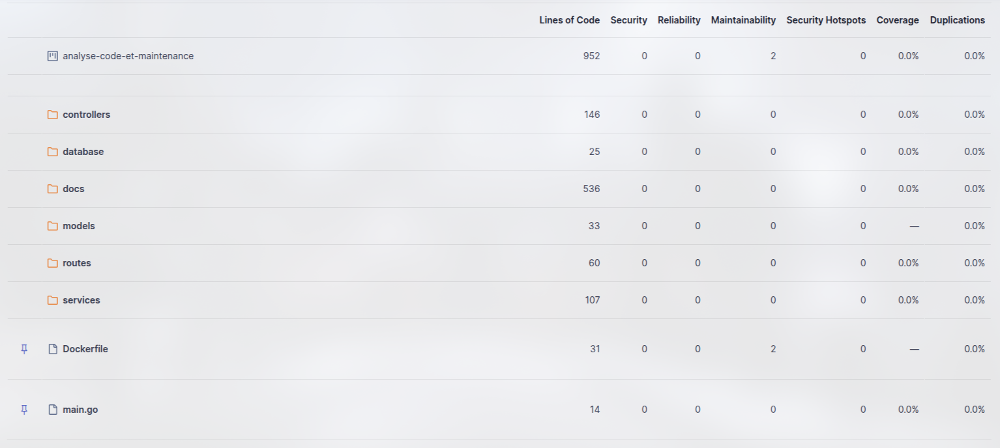
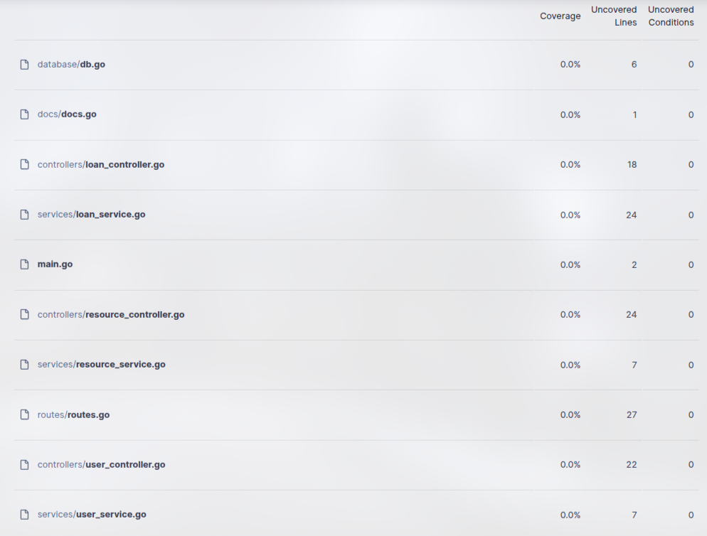
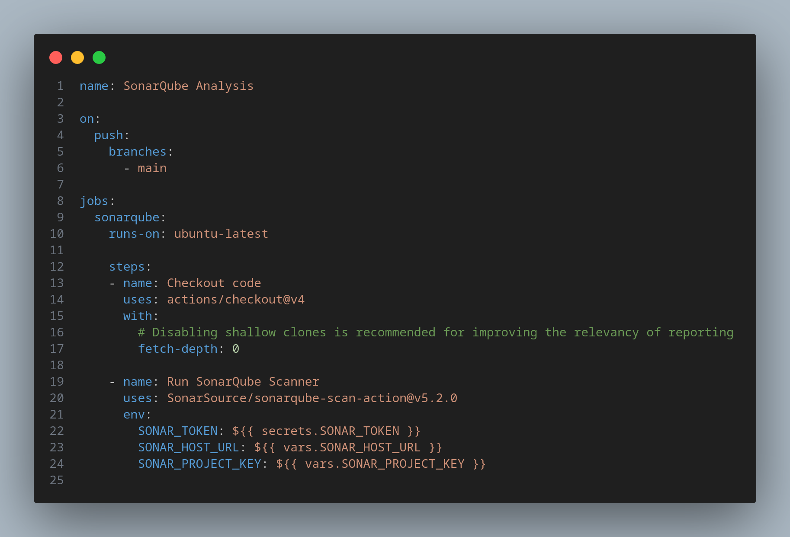

# Analyse Maintenance - Application Web avec Gin

Cette application est une API développée en Go avec le framework Gin. Elle utilise MySQL comme base de données et est déployée avec Docker.

## Auteurs

- [William Andreo](https://github.com/Ayden1416)
- [Oussama Dahmani](https://github.com/ouskode)
- [Hugo Eschlimann](https://github.com/HugoEschlimann)

## Prérequis

Avant de lancer l'application, assurez-vous d'avoir installé les outils suivants :
- [Docker](https://www.docker.com/)
- [Docker Compose](https://docs.docker.com/compose/)

## Installation

1. Clonez le dépôt :
    ```bash
    git clone https://github.com/votre-utilisateur/analyse-maintenance.git
    cd analyse-maintenance
    ```
2. Lancez l'application :
    ```bash
    docker compose up --build
    ```

3. Accédez à l'application :
   Ouvrez votre navigateur et allez à `http://localhost:8080`.

4. Accédez à la database :
    ```bash
    docker exec -it analyse-maintenance-db-1 mysql -u user -ppassword
    ```

## Utilisation

Pour accéder à la documentation : `http://localhost:8080/swagger/index.html`

### Users

1. Créez un utilisateur :
    ```bash
    curl -X POST http://localhost:8080/api/users \
         -H 'Content-Type: application/json' \
         -d '{"firstname": "testfirstname", "lastname": "testlastname", "email": "test@gmail.com", "phone": "0123456789", "nationality": "france"}'
    ```

2. Récupérez tous les utilisateurs :
    ```bash
    curl -X GET http://localhost:8080/api/users
    ```

3. Modifiez un utlisateur :
    ```bash
    curl -X PUT http://localhost:8080/api/users/<uuid> \
         -H 'Content-Type: application/json' \
         -d '{"nationality": "german"}'
    ```

4. Archivez un utilisateur :
    ```bash
    curl -X DELETE http://localhost:8080/api/users/<uuid>
    ```

5. Restorez un utilisateur :
    ```bash
    curl -X PUT http://localhost:8080/api/users/<uuid>/restore
    ```

### Resources

1. Créez une ressource :
    ```bash
    curl -X POST http://localhost:8080/api/resources \
         -H 'Content-Type: application/json' \
         -d '{"title": "Interstellar", "type": "film", "author": "Christopher Nolan", "is_available": true}'
    ```

2. Récupérez tous les ressources :
    ```bash
    curl -X GET http://localhost:8080/api/resources
    ```

3. Modifier une ressource :
    ```bash
    curl -X PUT http://localhost:8080/api/ressources/1 \
         -H 'Content-Type: application/json' \
         -d '{"type": "book"}'
    ```

4. Supprimer une ressource :
    ```bash
    curl -X DELETE http://localhost:8080/api/resources/1
    ```

### Loans

1. Créez un emprunt :
    ```bash
    curl -X POST http://localhost:8080/api/loans \
         -H 'Content-Type: application/json' \
         -d '{"user_id": 1, "resource_id": 1, "return_date": "20-06-2025"}'
    ```

2. Récupérez tous les emprunts :
    ```bash
    curl -X GET http://localhost:8080/api/loans
    ```

3. Modifier un emprunt :
    ```bash
    curl -X PUT http://localhost:8080/api/loans/1
    ```

4. Supprimer un emprunt :
    ```bash
    curl -X DELETE http://localhost:8080/api/loans/1
    ```

## Analyse SonarQube

### Vue d'ensemble





### Axes d'amélioration



## Pipeline CI/CD

A chaque push sur la branche main, une github action est lancée.
1ère étape, ça récupère le code de notre repo git
2ème étape, ça lance une analyse sonarqube avec les variables du repo qu'on lui passe


